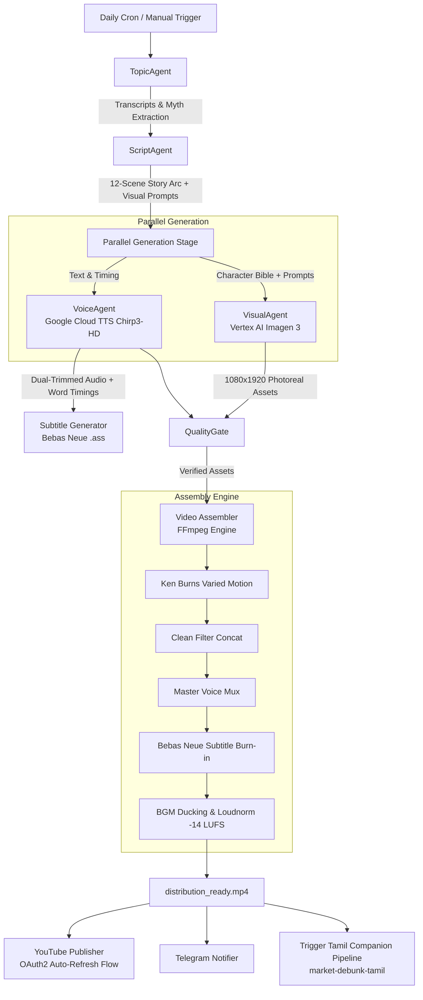

# Market Debunk Autonomous
### *Autonomous Multi-Agent YouTube Shorts Pipeline for Financial Education*

[](https://github.com/arunachalamvenkatachalapathy-dev/market-debunk-autonomous/actions/workflows/daily_video.yml)
[](https://www.python.org/downloads/)
[](https://opensource.org/licenses/MIT)

**Market Debunk Autonomous** is a production-grade autonomous agent swarm that scouts financial media daily, debunks predatory marketing and common retail investing myths, generates photorealistic cinematic video and neural voiceover, and publishes broadcast-ready YouTube Shorts (1080x1920 vertical, 30fps) with zero human intervention.

---

## 🎬 Narrative Philosophy & Channel Identity

The channel rejects generic AI explainers, robotic bullet-point summaries, and stock-photo collages. Every video is built as a **late-night cinematic confession** — a gripping, personal documentary thriller where the viewer is the protagonist.

* **Tone:** Sophisticated, quiet, dangerous, analytical. No smiling teachers, no generic disclaimers.
* **Format:** Exactly 12 scenes (~50 seconds runtime) structured into a high-retention continuous storytelling arc.
* **Perspective:** Strict second-person address (*"you"* and *"your"*) across at least 8 scenes.
* **Palette:** Photoreal split amber-teal lighting, dark textured surfaces, macro bokeh, and warm practical lamps.
* **Characters:**
  * **Arjun (The Host, Scenes 1–10):** 33, Indian, charcoal linen shirt. Analytical, intense, confessional. He breaks down the illusion and mechanism.
  * **Priya (The Closer, Scenes 11–12):** 33, Indian woman, charcoal silk, gold pendant. Calm, lethal authority. She names the formal financial concept and delivers the actionable defense.

---

## 🏗️ System Architecture

The pipeline operates as a modular, deterministic agent swarm orchestrated by `ManagerAgent`:



---

## 🤖 Agent Breakdown

### 1. `TopicAgent` (`src/agents/topic_agent.py`)
* Scans top Indian financial channels (daily indexed registry including Money Pechu, PR Sundar, Money Purse, Trade Achievers, Zerodha).
* Uses `yt-dlp` and YouTube Transcript APIs to extract recent video transcripts.
* Extracts core financial theses and identifies deceptive schemes (e.g., No-Cost EMI traps, false breakout triggers, dividend yield illusions).
* Enforces a 30-day semantic deduplication window via `data/used_topics.json`.

### 2. `ScriptAgent` (`src/agents/script_agent.py`)
* Transforms the financial thesis into a 12-scene continuous spoken narrative.
* **Continuous Monologue Architecture:** Prohibits disconnected fact bullets. Every scene connects to the next via natural narrative bridges (*"and"*, *"so"*, *"until"*, *"because"*, *"that is when"*).
* Strict Pydantic validation (`ScriptPayload`):
  * Exactly 12 scenes in strict order.
  * Word count bounded to 100–115 words total (~50s target).
  * Enforces `you`/`your` direct address in at least 8 scenes.
  * Enforces character presence: Arjun in scenes 1–10, Priya in scenes 11–12.
* Automated repair pass: Retries and self-repairs if schema or character constraints fail.

### 3. `VoiceAgent` (`src/agents/voice_agent.py`)
* Synthesizes broadcast-quality audio via Google Cloud Text-to-Speech (`en-IN-Chirp3-HD-Fenrir`).
* **Zero Artificial SSML Breaks:** Relies on neural prosody, eliminating unnatural pauses mid-sentence.
* **Dual-Ended Silence Trimming with Breath Cushion:** Uses FFmpeg `silenceremove` (leading + trailing) combined with `apad=pad_dur=0.08`. Eliminates dead inter-scene gaps while guaranteeing trailing consonants are never clipped.
* Generates character-weighted word timing metadata for dynamic subtitle styling.

### 4. `VisualAgent` (`src/agents/visual_agent.py`)
* Generates 1080x1920 vertical cinematic images via Google Vertex AI Imagen 3 (`imagegeneration@006`).
* Automatically injects the **Character Bible** to maintain visual facial, wardrobe, and aesthetic consistency across Arjun and Priya.
* Enforces negative prompting against text overlays, watermarks, cartoons, and distorted anatomy.

### 5. `Assembler` (`src/rendering/assembler.py`)
* **Dynamic Animation:** Applies subtle Ken Burns pan/zoom variations per scene (`zoompan`).
* **Clean Re-encode Concatenation:** Concatenates scene clips via FFmpeg `filter_complex concat` with re-encoding, eliminating B-frame boundary freeze and container timing jitter.
* **Master Voice Track:** Decodes scene audio to uncompressed 48kHz PCM WAVs before concatenation, eliminating MP3 LAME encoder padding micro-gaps.
* **Bebas Neue Subtitle Burning:** Hard-burns stylized ASS subtitles using the bundled `Bebas Neue` typeface with dynamic word-by-word highlight emphasis.
* **Audio Mixing & Loudness:** Layers background music with sidechain ducking under speech and normalizes audio to **-14 LUFS** (YouTube standard).

### 6. `QualityGate` (`src/agents/quality_gate.py`)
* Pre-release automated verification checks:
  * Video duration within bounds (38.0s – 58.0s).
  * Video resolution (1080x1920) and aspect ratio (9:16).
  * Audio stream presence, sample rate (48kHz), and channel count.
  * File size and bit rate safety limits.

### 7. `Publishing Engine` (`src/publishing/`)
* **YouTube Uploader (`youtube_uploader.py`):** Fully automated OAuth2 refresh token workflow via `google.oauth2.credentials.Credentials`. Uploads video, sets SEO title, description, and hashtags.
* **Telegram Notifier (`telegram_notifier.py`):** Broadcasts video links and execution logs to community channels.
* **Companion Pipeline Trigger:** Emits repository dispatch events to synchronize visual assets and trigger the Tamil sister pipeline ([`market-debunk-tamil`](https://github.com/arunachalamvenkatachalapathy-dev/market-debunk-tamil)).

---

## 📁 Repository Structure

```text
market-debunk-autonomous/
├── .github/
│   └── workflows/
│       └── daily_video.yml       # Scheduled daily GitHub Actions pipeline
├── assets/
│   ├── animations/               # Branded stock loops
│   ├── audio/                    # SFX and background loops
│   ├── avatars/                  # Character reference portraits
│   ├── bgm/                      # Curated background tracks
│   ├── fonts/
│   │   └── BebasNeue-Regular.ttf # High-retention subtitle typeface
│   └── brand_protection.png      # Channel watermark overlay
├── data/
│   ├── channel_ids.json          # Target YouTube channel IDs
│   └── used_topics.json          # Deduplication state registry
├── scripts/
│   ├── bootstrap_assets.py       # Asset verification and setup
│   ├── deploy_secrets.py         # Secret management automation
│   ├── mix_audio.py              # Audio testing tool
│   └── youtube_auth.py           # One-time OAuth2 refresh token generator
├── src/
│   ├── agents/
│   │   ├── manager.py            # Master orchestrator
│   │   ├── topic_agent.py        # Scraping & myth discovery
│   │   ├── script_agent.py       # 12-scene continuous storytelling
│   │   ├── voice_agent.py        # Neural TTS synthesis
│   │   ├── visual_agent.py       # Imagen 3 generation
│   │   ├── quality_gate.py       # Release validation gates
│   │   └── evaluator.py          # Post-generation critique
│   ├── publishing/
│   │   ├── youtube_uploader.py   # YouTube Data API v3 publisher
│   │   └── telegram_notifier.py  # Telegram notification client
│   ├── rendering/
│   │   ├── assembler.py          # FFmpeg video assembly engine
│   │   └── subtitles.py          # ASS subtitle generator
│   └── utils/
│       ├── config.py             # Central Pydantic / environment config
│       ├── logger.py             # Structured JSON & console logger
│       └── youtube_titles.py     # SEO title formatting utilities
├── tests/
│   └── test_release_guards.py    # Automated test suite
├── Dockerfile                    # Container definition for Cloud Run
├── requirements.txt              # Production Python dependencies
└── README.md                     # Project documentation
```

---

## 🚀 Quickstart & Local Setup

### 1. Prerequisites
* Python 3.11+
* FFmpeg (must be available on system `PATH`)
* Google Cloud Project with Vertex AI & Cloud Text-to-Speech APIs enabled

### 2. Clone & Install
```bash
git clone https://github.com/arunachalamvenkatachalapathy-dev/market-debunk-autonomous.git
cd market-debunk-autonomous
python -m venv venv
source venv/bin/activate  # Or `venv\Scripts\activate` on Windows
pip install -r requirements.txt
```

### 3. Environment Variables
Create a `.env` file in the project root (see `src/utils/config.py` for all options):

```env
# Google Cloud
GCP_PROJECT_ID=your-gcp-project-id
GOOGLE_APPLICATION_CREDENTIALS=/path/to/service-account.json

# YouTube Publishing (Automated OAuth2)
ENABLE_YT_UPLOAD=false
ALLOW_PUBLICATION=false
YT_CLIENT_ID=your-client-id.apps.googleusercontent.com
YT_CLIENT_SECRET=your-client-secret
YT_REFRESH_TOKEN=your-refresh-token

# Optional Notifications
TELEGRAM_BOT_TOKEN=your-telegram-bot-token
TELEGRAM_CHAT_ID=your-chat-id
```

### 4. Execute the Pipeline
Run the master orchestration agent locally:
```bash
python -m src.agents.manager
```

---

## 🔐 OAuth2 Refresh Flow Explained

YouTube uploads do **not** require manual re-authentication. The upload engine uses standard OAuth2 refresh credentials:

```python
from google.oauth2.credentials import Credentials

creds = Credentials(
    token=None,
    refresh_token=settings.YT_REFRESH_TOKEN,
    token_uri="https://oauth2.googleapis.com/token",
    client_id=settings.YT_CLIENT_ID,
    client_secret=settings.YT_CLIENT_SECRET,
    scopes=["https://www.googleapis.com/auth/youtube.upload"],
)
```
At upload time, the Google API client automatically exchanges `YT_REFRESH_TOKEN` for a short-lived access token. To obtain the initial refresh token during first-time setup, run `python scripts/youtube_auth.py`.

---

## 🔄 GitHub Actions Automation

The entire pipeline runs on a daily cron schedule via `.github/workflows/daily_video.yml`:
1. Checks out repository and sets up Python 3.11.
2. Installs FFmpeg and font assets (`assets/fonts/BebasNeue-Regular.ttf`).
3. Authenticates with Google Cloud via Workload Identity / GCP credentials.
4. Executes `python -m src.agents.manager`.
5. Uploads generated video and metadata artifacts.
6. Commits updated deduplication records (`data/used_topics.json`).
7. Triggers the companion Tamil pipeline via repository dispatch.

---

## 📄 License
This project is licensed under the MIT License — see the LICENSE file for details.